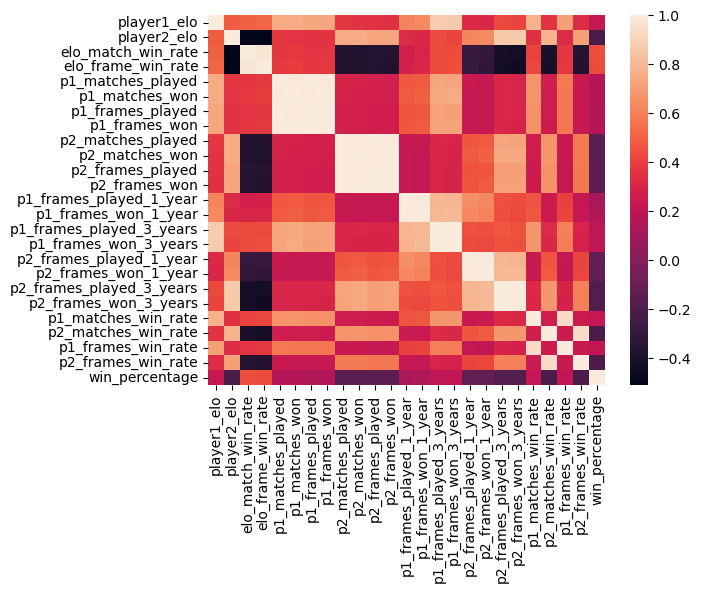
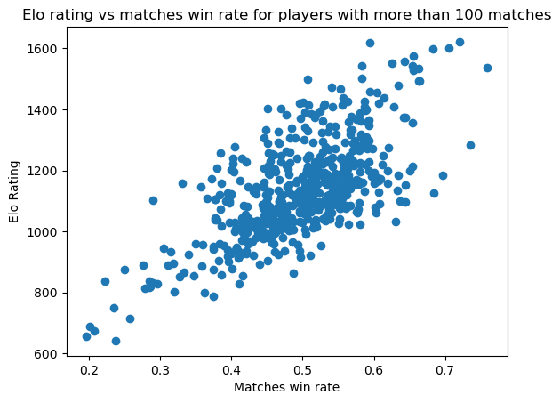
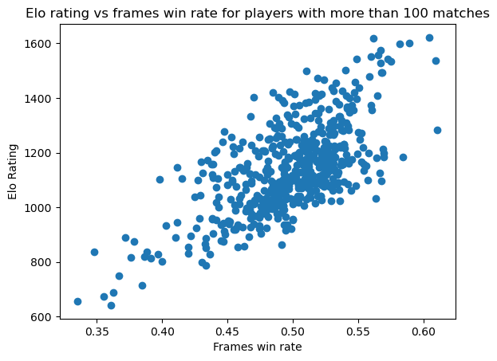
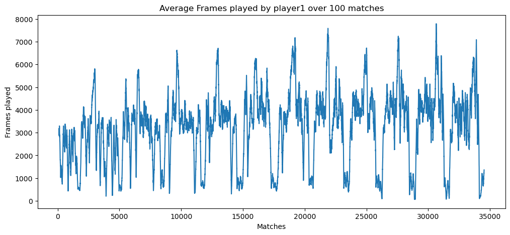
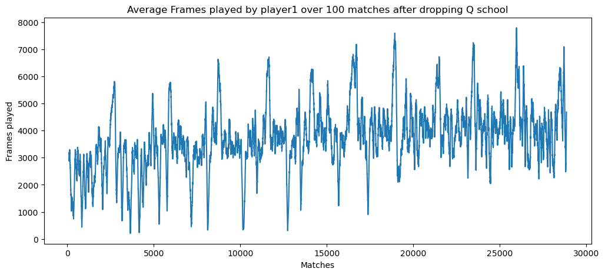
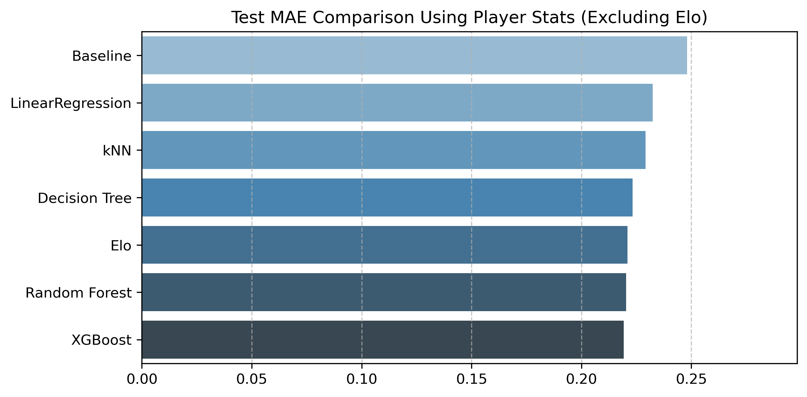
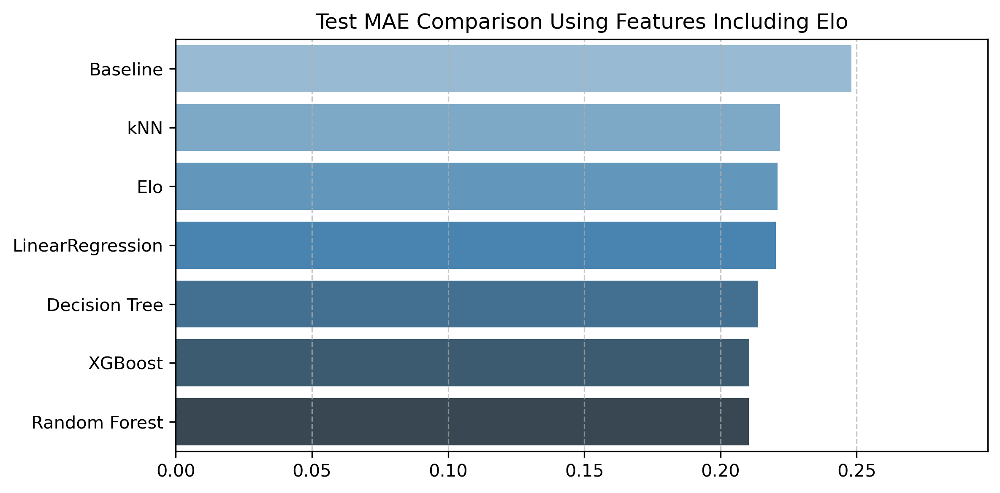
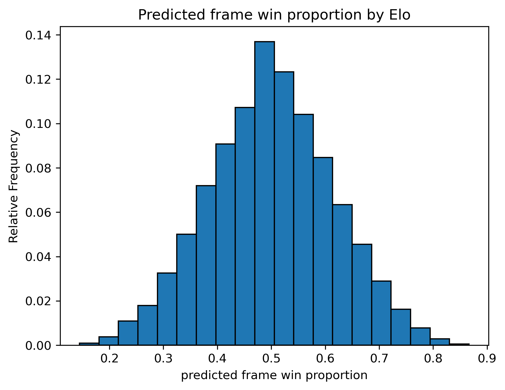
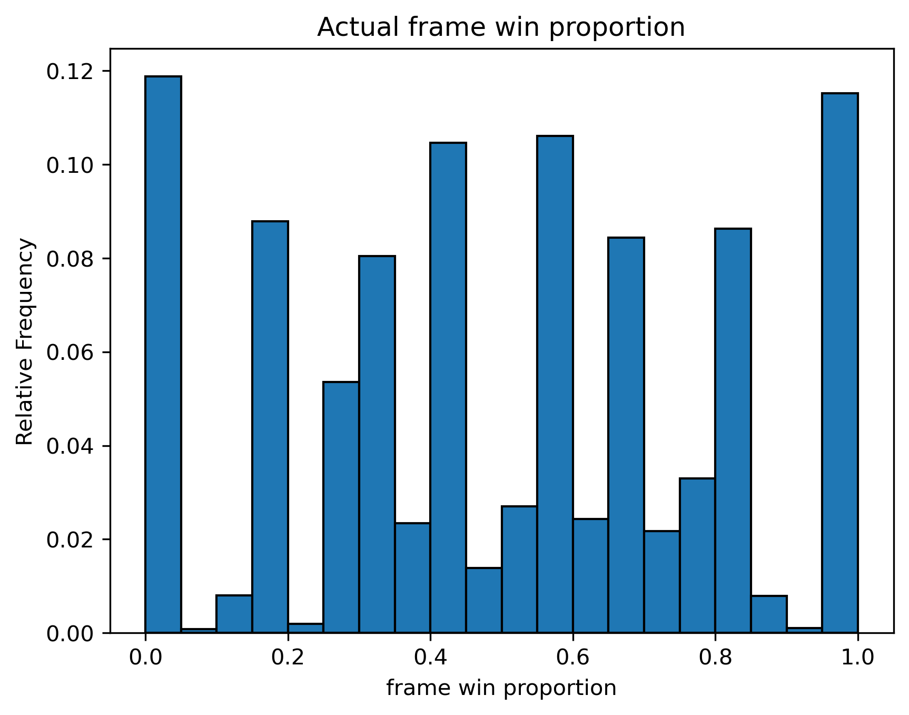

# Elo Rating and Match Prediction on Professional Snooker

## Group Membters: Pubo Huang, Tianxiang (Jimmy) Liu, Rubaiyat Bin Islam  

## Project Overview 
We created a Elo rating system for professional snooker players which assigns a number to
each player that reflects their skill levels. We then created several machine learning models that predict
the machine result and scores based on players’ Elo ratings and their statistics.

## Elo Rating System  
The Elo Rating System assigns each player a number that represents the skill levels in a zero-sum game. We built a elo rating system for professional snooker players so that the difference of two players ratings predicts the win rate of one player in one frame. If we let R1 and R2 denote the Elo rating for player1 and player2, then the expected win rate of player1 is $E1 = \frac{1}{1 + e^{(R2-R1)/400}}$.  

We update players' elo ratings after each match. The update rule is the following:  
Suppose player1 and player2 play a match and the scores are score1 and score2. Then their actual frame win rate is $S1 = \frac{\text{score1}}{\text{score1}+\text{score2}}$ and $S2 = \frac{\text{score2}}{\text{score1}+\text{score2}}$.  
After this match, the elo-rating for player1 will be updated: 
$R_{1, new} = R1 + K * (\text{score1}+\text{score2}) * (S1-E1)$,  
where K is the K-factor which we sets to 8. We picked this K-factor after [experimenting](/2_Elo_Rating_System/elo_v4/elo_v4_test2.ipynb) a broad range of values from 4 to 30. 

## Dataset (Acquisition, Cleaning and Generation):
We acquired snooker [match data (1982-2020)](https://www.kaggle.com/datasets/rusiano/snooker-data-19822020) from Kaggle submitted by user rusiano. The data comes from [cuetracker.net](cuetracker.net), which is used by many parties including bookmakers and sport commentators. We scaped the data from 2020 to 2025 directly from [cuetracker.net](cuetracker.net).  

We dropped the walkover matches, those with score 0-0, and amateur and pro-am matches. We cleaned the players' names columns by removing the unnecessary numbers and country names to prevent duplication of players. We also sorted the matches by tournament start date and , within a tournament, by the order of stages. Finally, we combined two datasets to form a dataset of 115,630 professional snooker matches from 1982 to 2025 and store it as [matches.csv](/1_Match_Data/matches.csv).  

Since the above data only contains the match result, we need to generate features for modelings. To generate the data for future modeling, we used our [elo rating system](/2_Elo_Rating_System/elo_v4). In particular, for the matches in the last 300 tournaments, we calculated the elo ratings and statistics (such as matches played, frames played) at the moment the players entered the tournament. We also calculated the win rates of player1 predicted by elo rating system and append them to each match data. Finally, we get the data of matches in the last 300 tournaments (34,521 matches) together with players' names, players' elo ratings, elo predicted win rate, players' statistics and match results. The data is stored as [match_data_300_tourns_modified.csv](/3_Player_Data_Generation/match_data_300_tourns_modified.csv).

## Data Exploration:
1. In the player data exploration [folder](/4_Player_Data_Exploration), we investigated the possible relations within the Elo ratings and features obtained above. We found that among all the features, some groups of features have correlations with themselves. For example, as the heatmap below shows, one player's matches record (p1_matches_played, p1_matches_won, p1_frames_played, p1_frames_won) has high correlation to itself. We also notice for players with enough match records (played more than 100 matches), their elo ratings tend to be positively correlated with matches win rate and frames win rate.  
  

  
  

.  

2. Through out the 34k+ matches, we plotted the rolling average of prediction accuracy by Elo ratings over 300, 1000 and 2000 matches. We saw that the Elo prediction accuracy fluctuates between 0.62 and 0.72. We tried to investigate the reasons for it. For example, we dropped Q school tournaments, which are tournaments for amateurs to qualify for professional events. This eliminated the lots of matches between inexperienced players, as the two plots below show, but did not reduce the fluctuation of Elo prediction accuracy.  

.  

3. Among all the features, the elo predicted win has the highest correlation with win_percentage (the proportion of frames player1 win). This suggests that Elo ratings and Elo predicted win rates are strong features in predicting match scores.

## Predicting Frame Win Proportion

The dataset, consisting of matches from the last 300 tournaments, included 34,521 matches ordered chronologically from earliest to most recent. The most recent 20% of matches were set aside for testing the models. Model hyperparameters where applicable were tuned while training via Grid Search with cross-validation. Performances were compared using mean absolute error (MAE) on the test set.

  
  

The prediction errors are relatively high. We examined the following distributions to better understand the underlying reason.

  
  

Elo predictions tend to be normally distributed around 0.5, yet it is not uncommon for actual frame win rates to be close to 0\% or 100\% on days when one player significantly outperforms the other. This is a common issue in sports prediction: despite players having similar skill levels, one may dominate on a given day, and our current models fail to capture this behavior.
